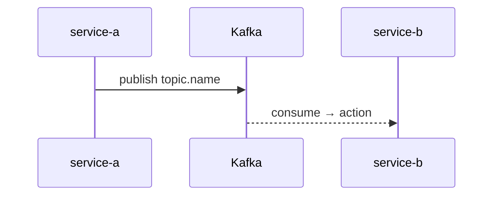

# fk-trace — Trace a Kafka event or data flow on Freshket

Given: $ARGUMENTS

## Steps

1. If `docs/ai/events/event-catalog.md` exists, read it — find the topic, producer, and consumers.
2. If `docs/ai/flows/` exists, check for an existing flow diagram that includes this topic or feature.
3. Read relevant `docs/ai/services/<service>.md` for producer and consumer details.
4. If docs/ai/ is absent: grep the codebase for the topic name or flow trigger to trace the chain manually.

## For each topic/flow, report

- **Producer**: which service, which file, which function, which Kafka library
- **Consumer(s)**: which services, entry file, consumer group ID if known
- **Payload schema location**: where the event struct is defined
- **Env suffix**: does this topic vary by environment (`.sit`, `.dev`)?
- **DLQ behavior**: how failures are handled
- **Gaps**: unknown producers/consumers marked clearly with confidence level

## Always produce a Mermaid sequence diagram



## Output format

```
## Event/Flow Trace: `<topic-or-feature>`

**Topic**: `<topic-name>` (or N/A for REST flows)
**Broker**: pkc-l9wvm.ap-southeast-1.aws.confluent.cloud:9092

### Producer
| Service | File | Function | Library |
|---------|------|---------|---------|

### Consumers
| Service | Entry File | Consumer Group | Library |
|---------|-----------|---------------|---------|

### Payload Schema
Location: `<file>`
Key fields: <list>

### Flow Diagram
[Mermaid diagram]

### Gaps
- [ ] <unknown> — needs verification

**Confidence**: Confirmed / Likely / Inferred per line item
```
