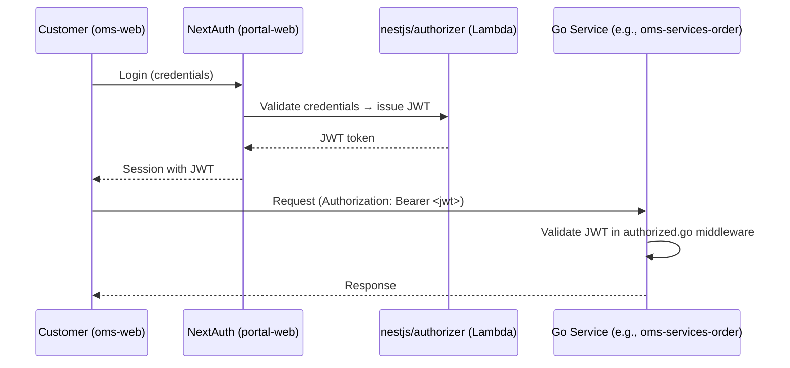
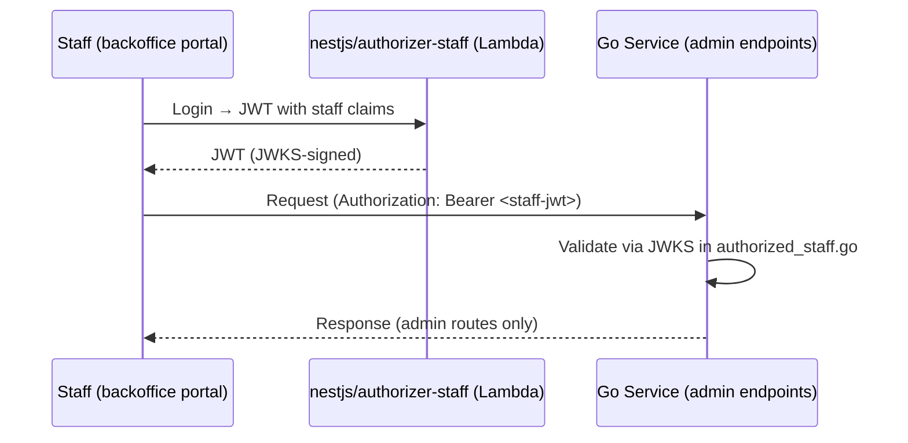
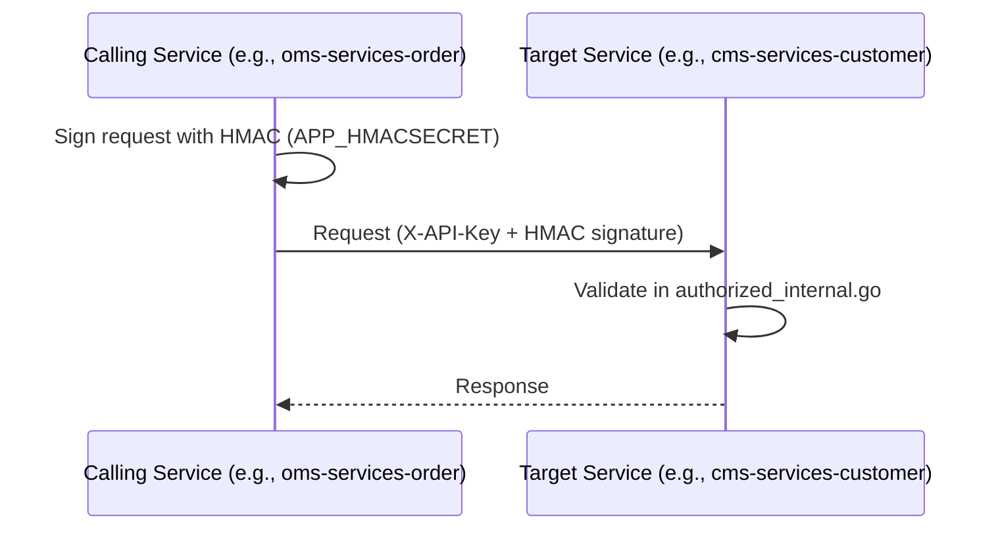
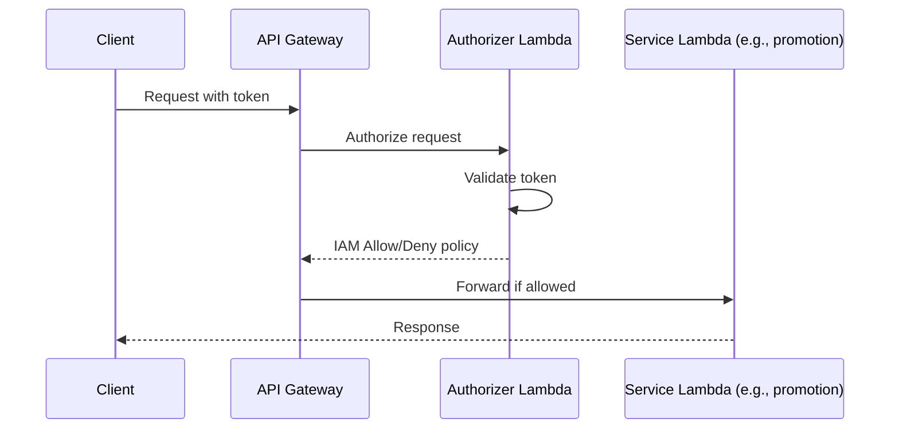

# Authentication Flow

## Overview
Three distinct authentication patterns used across the platform: customer JWT, staff JWT (JWKS), and internal service-to-service HMAC authentication.

## Authentication Types

### 1. Customer Authentication (JWT)

**Implementation:**
- Middleware: `oms-services-order/http/middleware/authorized.go`
- Token format: Bearer JWT
- Validator: Lambda custom authorizer (`oms-services-nestjs/apps/authorizer/`)
- Frontend: NextAuth (`@freshket/oms-web-next-auth-config`)

---

### 2. Staff Authentication (JWKS)

**Implementation:**
- Middleware: `oms-services-order/http/middleware/authorized_staff.go`
- JWKS endpoint: configured in staff authorizer Lambda
- Lambda: `oms-services-nestjs/apps/authorizer-staff/`

---

### 3. Internal Service-to-Service Authentication

**Implementation:**
- Middleware: `oms-services-order/http/middleware/authorized_internal.go`
- Header: `X-API-Key`
- Signing: HMAC with shared secret (`APP_HMACSECRET`)
- Used for: service-to-service calls on internal endpoints

---

### 4. Lambda API Gateway Authorization

**Implementation:**
- Customer authorizer: `oms-services-nestjs/apps/authorizer/`
- Staff authorizer: `oms-services-nestjs/apps/authorizer-staff/`
- Internal authorizer: `oms-services-nestjs/apps/authorizer-internal/`
- Configured in: `serverless-internal.yml`, `serverless-external.yml`

---

## Auth Configuration Summary

| Pattern | Header | Middleware File | Config |
|---------|--------|----------------|--------|
| Customer JWT | `Authorization: Bearer <token>` | `http/middleware/authorized.go` | JWT secret in env |
| Staff JWT (JWKS) | `Authorization: Bearer <token>` | `http/middleware/authorized_staff.go` | JWKS endpoint in env |
| Internal HMAC | `X-API-Key` | `http/middleware/authorized_internal.go` | `APP_HMACSECRET` |
| Lambda auth | API Gateway event | `apps/authorizer*/` (NestJS Lambda) | Serverless config |

## Files to Modify for Auth Changes

| Change | Primary File(s) |
|--------|----------------|
| Customer JWT validation logic | `oms-services-order/http/middleware/authorized.go` (pattern repeated per service) |
| Staff JWT / JWKS changes | `oms-services-nestjs/apps/authorizer-staff/` |
| Internal auth secret rotation | All services' `APP_HMACSECRET` env var |
| New authorizer Lambda | `oms-services-nestjs/apps/` + `serverless-*.yml` |
| Frontend auth config | `portal-web` `@freshket/oms-web-next-auth-config` |
| Feature flag per auth method | GrowthBook SDK in each service |

## Risks

- **Repeated middleware**: Each Go service has its own copy of auth middleware — changes must be applied to all services consistently
- **HMAC secret management**: Shared secret across all service-to-service calls — rotation requires coordinated deployment
