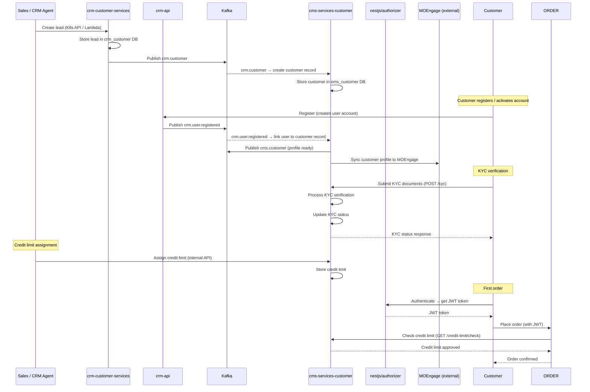

# Customer Onboarding Flow

## Overview
Flow from new customer lead creation through registration, KYC verification, and credit limit assignment — enabling the customer to place their first order.

## Sequence Diagram

## Key Services

| Service | Role |
|---------|------|
| crm-customer-services | Lead creation, Salesforce sync |
| crm-api | User registration, CRM backoffice |
| cms-services-customer | Customer of record: profile, KYC, credit limit |
| oms-services-nestjs/authorizer | JWT issuance for authenticated access |
| MOEngage | Marketing engagement after onboarding |

## Files to Modify for Onboarding Changes

| Change | Primary File(s) |
|--------|----------------|
| New lead field | `crm-customer-services/internal/domains/` |
| Customer profile field | `cms-services-customer/service/customer/`, migration |
| KYC flow | `cms-services-customer/service/customer/`, `api/customer-openapi.yaml` |
| Credit limit logic | `cms-services-customer/service/customer/` |
| Post-registration notification | `cms-services-customer/service/customer-notification/` |

## Integration Gaps

- 4 CRM-related env vars in cms-services-customer — determine which is authoritative for each use case
- `cms.customer` topic consumers are undocumented — who downstream receives the customer-ready signal?
