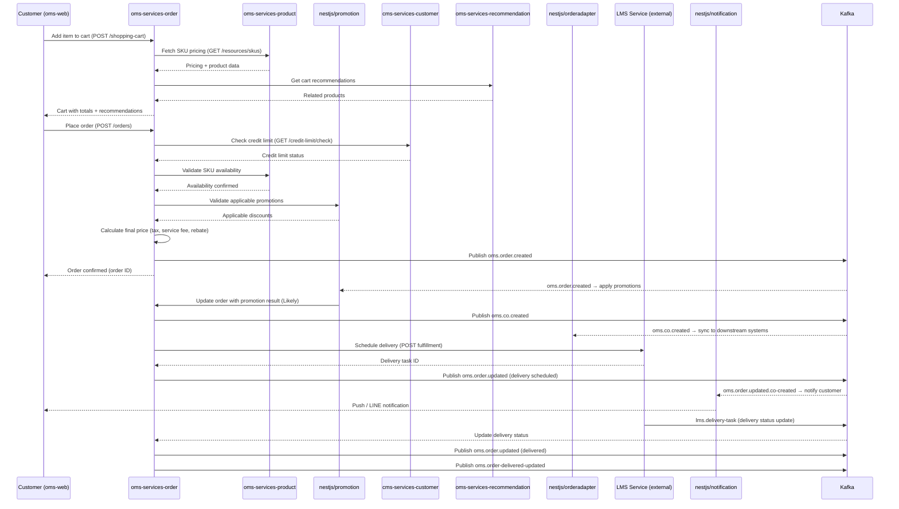

# Order Lifecycle Flow

## Overview
End-to-end flow from a B2B customer adding products to cart through delivery completion.

## Sequence Diagram

## Key Services

| Service | Role in Flow |
|---------|-------------|
| oms-services-order | Orchestrator — owns cart, order, delivery scheduling |
| oms-services-product | SKU pricing and availability validation |
| oms-services-nestjs/promotion | Promotion calculation and application |
| cms-services-customer | Credit limit gating |
| oms-services-recommendation | Cart recommendations |
| oms-services-nestjs/orderadapter | Syncs CO data to downstream |
| LMS (external) | Physical delivery execution |
| oms-services-nestjs/notification | Customer notifications |

## Files to Modify for Order Feature Changes

| Change | Primary File(s) |
|--------|----------------|
| New order field | `oms-services-order/pkg/order/`, `api/order-openapi.yaml`, migration |
| New calculation logic | `oms-services-order/pkg/calculation/` |
| Delivery slot changes | `oms-services-order/pkg/delivery/`, `api/delivery-openapi.yaml` |
| New promotion type | `oms-services-nestjs/apps/promotion/` |
| Cart recommendation changes | `oms-services-recommendation/` |

## Error Scenarios

| Scenario | Handling |
|----------|---------|
| Credit limit exceeded | ORDER rejects with 4xx, customer notified |
| SKU unavailable | ORDER returns validation error |
| Promotion invalid | ORDER proceeds without discount |
| Delivery scheduling fails | ORDER saves without delivery task (async retry) |
| Kafka publish fails | DLQ → Slack alert |
