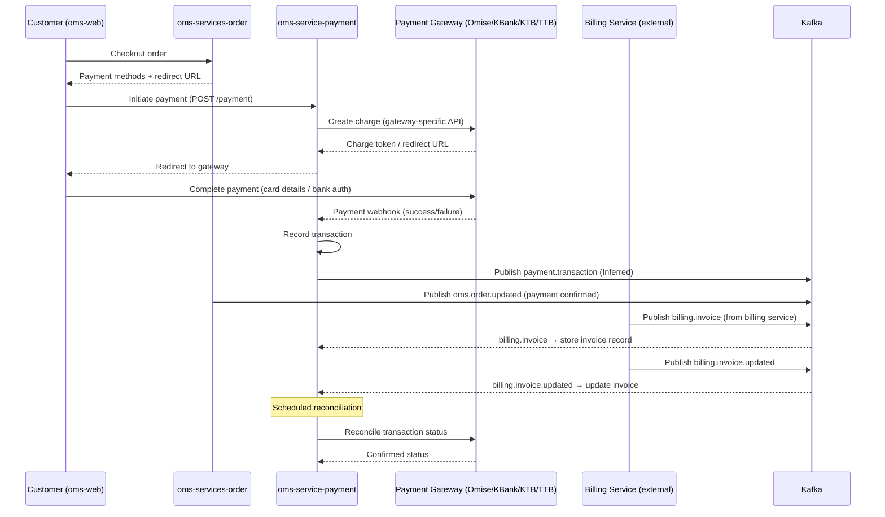

# Payment Flow

## Overview
Payment processing from checkout through gateway confirmation and invoice generation.

## Sequence Diagram

## Payment Gateways

| Gateway | Code Location | Usage |
|---------|--------------|-------|
| Omise | `third_party/omise/` | Primary Thai payment gateway |
| KBank | `third_party/kbank/` | Thai bank gateway |
| KTB | `third_party/ktb/` | Krungthai bank gateway |
| TTB | `third_party/ttb/` | TMBThanachart bank gateway |
| Offline | `third_party/offline` | Manual/bank transfer payments |

Gateway selection: `APP_PAYMENTGATEWAY` env var → `omise` / `kbank` / `ktb` / `ttb` / `offline`

## Payment Methods

| Method | Kafka Topic | Confidence |
|--------|-------------|-----------|
| Standard charge | `payment.transaction` | Confirmed (consumed) |
| Invoice payment | `billing.invoice` | Confirmed (consumed) |
| Credit note / refund | `billing.credit-note` | Confirmed (consumed) |
| Cash voucher | `billing.cash-voucher` | Confirmed (consumed) |
| Coin (loyalty points) | `payment.coin` | Confirmed (consumed) |

## Files to Modify for Payment Feature Changes

| Change | Primary File(s) |
|--------|----------------|
| New payment gateway | `oms-service-payment/third_party/<gateway>/`, `config/thirdparty/` |
| New payment method | `oms-service-payment/internal/services/`, Kafka consumer config |
| Invoice processing | `oms-service-payment/internal/services/invoice/` |
| Scheduled reconciliation | `oms-service-payment/cmd/scheduler/` |
| Feature flag for gateway | `oms-service-payment/` GrowthBook integration |

## Gaps

- Producer of `billing.*` topics is unknown (billing service is in a separate repo not indexed here)
- Payment redirect URL (`APP_JULIANBASEURL`) points to oms-web customer portal
- No OpenAPI spec for oms-service-payment REST endpoints
