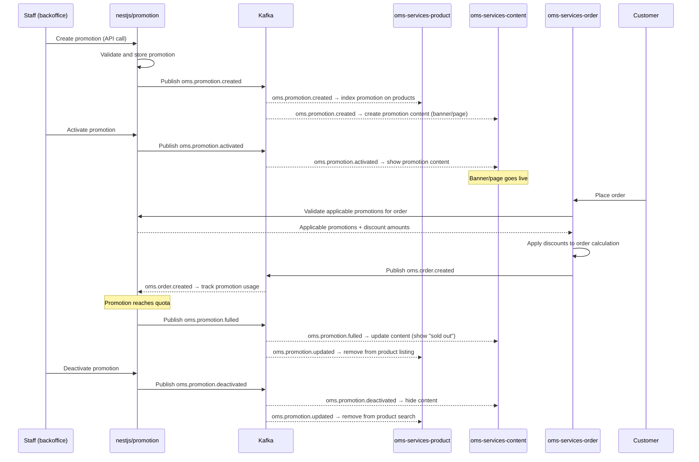

# Promotion Flow

## Overview
Lifecycle of a promotion from staff creation through customer order application and content display.

## Sequence Diagram



## Key Services

| Service | Role |
|---------|------|
| oms-services-nestjs/promotion | Owns promotion rules, lifecycle, quota management |
| oms-services-product | Indexes promotions on products for search/display |
| oms-services-content | Shows promotion banners/pages to customers |
| oms-services-order | Applies promotion discounts during order calculation |

## Promotion Event Flow

```
oms.promotion.created   → product (index) + content (create)
oms.promotion.updated   → product (re-index) + content (update)
oms.promotion.activated → content (show)
oms.promotion.deactivated → content (hide)
oms.promotion.fulled    → content (sold-out display)
```

## Files to Modify for Promotion Feature Changes

| Change | Primary File(s) |
|--------|----------------|
| New promotion type / rule | `oms-services-nestjs/apps/promotion/` |
| Promotion content display | `oms-services-content/pkg/promotion/`, `event/` |
| Promotion on product search | `oms-services-product/event/` |
| Promotion application in order | `oms-services-order/thirdparty/promotionapi/`, `pkg/calculation/` |
| Promotion banner UI | `portal-web/apps/oms-web/` |

## Topic Note

Content service topics include environment suffix:
- Dev: `oms.promotion.activated.dev`
- SIT: `oms.promotion.activated.sit`
- UAT/PROD: Confirm via env config
