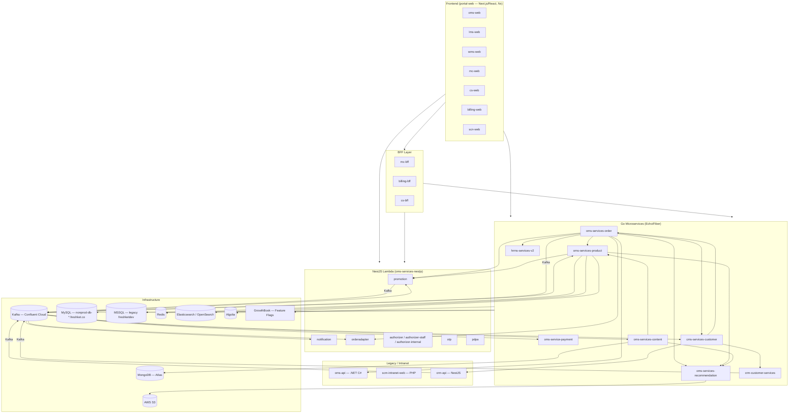

# System Overview — Freshket Platform

## Purpose
Thai B2B food-delivery and e-commerce platform. Buyers (restaurants, food businesses) order fresh produce from Freshket. The platform handles ordering, fulfillment, payments, CRM, and content management.

## High-Level Architecture

## Service Domains

| Domain | Services | Boundary |
|--------|----------|----------|
| **Order** | oms-services-order | Carts, orders, bulk orders, calculations, delivery scheduling |
| **Product / Catalog** | oms-services-product | SKUs, categories, brands, labels, pricing, search |
| **Recommendation** | oms-services-recommendation | Product recommendations |
| **Payment** | oms-service-payment | Charges, invoices, credit notes, cash vouchers, coins |
| **Customer** | cms-services-customer | Customer profiles, KYC, credit limits |
| **CRM / Lead** | crm-customer-services, crm-api | Lead management, Salesforce sync, customer acquisition |
| **Promotion** | oms-services-nestjs/promotion | Promotion lifecycle, discount calculation |
| **Notification** | oms-services-nestjs/notification | Push, LINE, email notifications |
| **Content** | oms-services-content | Posts, pages, banners, brand content |
| **Auth** | oms-services-nestjs/authorizer* | JWT issuance and validation (customer, staff, internal) |
| **HRMS** | hrms-services-v2 | HR and staff management |
| **Frontend** | portal-web | Multi-domain web apps |
| **Infrastructure** | fkt-platform-charts | K8s Helm charts, ArgoCD GitOps |

## Communication Patterns

### Synchronous (REST/HTTP)
- Frontend → Backend: REST via internal service URLs or BFF
- Service-to-service: HTTP clients in `thirdparty/` or `infrastructure/api/` packages
- Auth: Bearer JWT for customers, JWKS for staff, HMAC + X-API-Key for internal

### Asynchronous (Kafka — Confluent Cloud)
- Broker: `pkc-l9wvm.ap-southeast-1.aws.confluent.cloud:9092`
- Go services: Shopify/sarama or segmentio/kafka-go
- NestJS services: kafkajs
- Topics follow naming: `{domain}.{entity}.{action}[.{env-suffix}]`
- DLQ failures alert to Slack

## Deployment

- Environments: **SIT → UAT → PROD**
- Trigger: `deploy/x.x.x` (K8s only) or `release/x.x.x` (K8s + Lambda) branches
- ArgoCD nonprod: `https://nonprod-argocd.freshket.co/`
- ArgoCD prod: `https://argocd.freshket.co/`
- Go services: containerized, deployed via Helm charts in `fkt-platform-charts/`
- NestJS services: AWS Lambda via Serverless Framework (dual mode: Lambda + K8s container)

## Shared Infrastructure

| System | Purpose | Used By |
|--------|---------|---------|
| GrowthBook | Feature flags | All Go services, portal-web |
| Confluent Kafka | Async events | order, product, content, payment, customer, nestjs, crm |
| GitHub Actions | CI/CD | All services |
| OpenTelemetry | Tracing / Observability | portal-web, oms-service-payment |
| DataDog | RUM (frontend) | portal-web |
| `github.com/freshket/go-utility` | Shared Go lib | All Go services |
| `@freshket/*` npm packages | Shared frontend/TS libs | portal-web |
